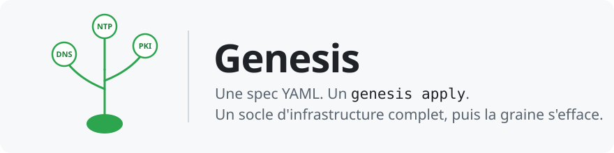
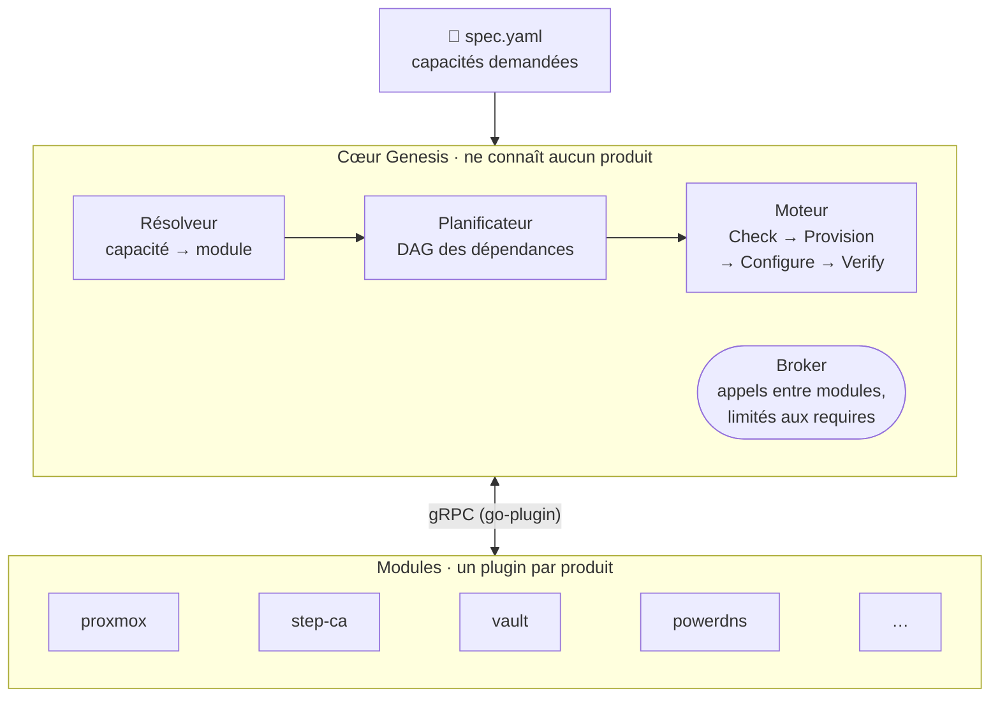
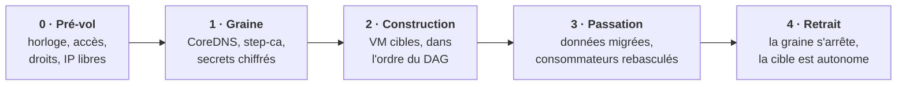

<p align="center">
  
</p>

<p align="center">
  <a href="https://github.com/WhiteRoseLK/genesis/actions/workflows/ci.yml"></a>
  <a href="https://github.com/WhiteRoseLK/genesis/releases"></a>
  <a href="go.mod"></a>
  <a href="LICENSE"></a>
</p>

<p align="center">
  <a href="#-pourquoi-genesis">Pourquoi</a> ·
  <a href="#-comment-ça-marche">Comment ça marche</a> ·
  <a href="#-à-quoi-ressemble-une-spec">Exemple</a> ·
  <a href="#-démarrer">Démarrer</a> ·
  <a href="#-feuille-de-route">Feuille de route</a> ·
  <a href="#-documentation">Documentation</a>
</p>

---

**Genesis** construit automatiquement un **socle d'infrastructure autonome** (heure, DNS, PKI, secrets, bastion) sur un cluster de virtualisation existant, à partir d'un **unique fichier YAML** qui décrit des *capacités*, pas des technologies.

Vous écrivez « il me faut un DNS, une PKI et un bastion » ; Genesis choisit les modules, calcule l'ordre, crée les VM, installe et vérifie chaque service, puis **passe le relais** à l'environnement qu'il vient de bâtir.

> [!WARNING]
> **Projet en développement (itération 1, v0.x).** L'API, le format de spec et le contrat de module peuvent encore changer. Les modules n'ont pas encore été exécutés contre un vrai cluster Proxmox : ils sont testés contre des fixtures et des conteneurs jetables ([#30](https://github.com/WhiteRoseLK/genesis/issues/30)). Ne pas utiliser en production.

## ✨ Pourquoi Genesis

- **Vous décrivez le besoin, pas la recette.** La spec liste des capacités (`dns`, `pki`, `bastion`…) ; le module qui les fournit est un détail, remplaçable.
- **Un cœur qui ne connaît aucun produit.** Chaque produit (PowerDNS, Vault, Teleport…) est un module séparé, en plugin gRPC. Ajouter un produit, ou une couche entière comme la construction de l'hyperviseur, revient à ajouter un module, sans toucher au cœur.
- **L'œuf et la poule, résolus.** Pour construire un DNS, il faut… un DNS. Genesis démarre depuis une **graine** (VM, serveur, Raspberry Pi) qui fournit des services temporaires, construit la cible, lui transfère le relais puis **s'efface**.
- **Rejouable sans risque.** Chaque étape vérifie avant d'agir : relancer `apply` ne change rien si tout est déjà conforme, et reprend là où une exécution interrompue s'était arrêtée.
- **Aucun secret en clair.** Secrets générés, chiffrés (age) puis migrés dans Vault ; masqués dans les journaux, l'état et les erreurs.

## 🌱 Comment ça marche



L'ordre de construction n'est écrit nulle part : il découle des fonctions que chaque module déclare fournir (`provides`) et requérir (`requires`). Un module ne parle à un autre que par le **broker**, et seulement pour les fonctions qu'il a déclarées : vault, par exemple, obtient son certificat de step-ca en appelant `pki.issuer/v1` à travers le broker, sans connaître step-ca.

### Le cycle de vie d'un `apply`



### Capacités et modules de l'itération 1

| Capacité | Pendant la graine | Service cible | Fonction |
|---|---|---|---|
| `compute` | — | **proxmox** | `compute.vm/v1` (VM Proxmox VE) |
| `time` | NTP amont | **chrony** | `time.ntp/v1` |
| `dns` | **coredns** | **powerdns** | `dns.zone/v1`, `dns.resolver/v1` |
| `pki` | **step-ca** | **vault** | `pki.issuer/v1` |
| `secrets` | fichiers chiffrés (age) | **vault** | `secrets.kv/v1` |
| `bastion` | — | **teleport** | `access.ssh/v1`, agent sur chaque VM |

S'y ajoutent `base-os` (configuration commune de chaque VM : CA, résolveur, NTP) et `fake-compute` (VM simulées en conteneurs, pour les tests de bout en bout).

## 📄 À quoi ressemble une spec

```yaml
apiVersion: genesis/v1alpha1
kind: Environment
metadata:
  name: lab

network:
  cidr: 10.10.0.0/24
  gateway: 10.10.0.1
  pool: 10.10.0.50-10.10.0.99
  domain: lab.internal

seed:
  address: 10.10.0.10

capabilities:
  compute:
    module: proxmox
    config:
      endpoint: https://pve01.home.arpa:8006
      node: pve01
      image: debian-13
      credentials:
        token_id_ref: env://PVE_TOKEN_ID          # jamais de secret en clair :
        token_secret_ref: env://PVE_TOKEN_SECRET  # env://, file:// ou vault://
  time:    {}                  # module par défaut
  dns:     { module: powerdns }
  pki:     { module: vault }
  secrets: { module: vault }   # même module que pki → même instance
  bastion: { module: teleport }
```

Exemple complet et règles de validation : [docs/04-spec.md](docs/04-spec.md).

## 🚀 Démarrer

Prérequis : Go (version de [`go.mod`](go.mod)), `make`, et Docker ou Podman pour les tests d'intégration.

```sh
git clone https://github.com/WhiteRoseLK/genesis.git && cd genesis
make tools build test          # outils épinglés, compilation, tests unitaires

go run ./cmd/genesis --version
go run ./cmd/genesis validate -f spec.yaml   # valide la structure de la spec
go run ./cmd/genesis plan -f spec.yaml       # modules retenus et ordre de construction
```

| Commande | Rôle | État |
|---|---|---|
| `genesis init` | Prérequis de la graine, état local, clé maîtresse | ✅ |
| `genesis validate` | Structure de la spec (la résolution des modules y reste à brancher) | ✅ |
| `genesis plan` | Ordre de construction, modules ajoutés automatiquement | ✅ |
| `genesis apply` | Graine → construction → passation → retrait | ✅ |
| `genesis modules list · install · verify · scaffold` | Gestion des modules installés | ✅ |
| `genesis secrets list · get` | Secrets générés (métadonnées, puis valeur à la demande) | ✅ |
| `genesis status`, `genesis destroy` | État par module ; suppression de l'environnement | 🚧 |

### Écrire un module

```sh
go run ./cmd/genesis modules scaffold mon-module --provides dns.zone/v1
```

Génère `modules/mon-module/` : manifeste, `main.go` avec chaque étape en attente, schéma de configuration et test de conformité. Rien à modifier ailleurs dans le dépôt. Guide pas à pas : [docs/10-ajouter-un-module.md](docs/10-ajouter-un-module.md).

## 🗺️ Feuille de route

- [x] **J0–J2** · Squelette, spec et validation, secrets chiffrés et état
- [x] **J3** · SDK des modules, hôte de plugins, `scaffold`
- [x] **J4** · Résolveur, broker, planificateur, moteur
- [x] **J5** · `proxmox`, `base-os`
- [x] **J6** · `chrony`, `coredns`, `powerdns`, première passation graine → cible
- [x] **J7** · `step-ca`, `vault`, migration des secrets vers Vault
- [x] **J8** · `teleport`, retrait automatique de la graine
- [ ] **J9** · Durcissement et preuve d'extensibilité de bout en bout ([milestone](https://github.com/WhiteRoseLK/genesis/milestone/1), [#2](https://github.com/WhiteRoseLK/genesis/issues/2))

Au-delà de l'itération 1 : mode déconnecté (air-gap), supervision, forge logicielle, construction de l'hyperviseur sur matériel nu. Détail : [docs/PROGRESS.md](docs/PROGRESS.md) et [docs/08-jalons.md](docs/08-jalons.md).

## 📚 Documentation

<details>
<summary><b>Dossier de conception</b> (10 documents)</summary>

| # | Document | Contenu |
|---|----------|---------|
| 01 | [Vision et périmètre](docs/01-vision-perimetre.md) | Problème, objectifs, non-objectifs de l'itération 1 |
| 02 | [Architecture modulaire](docs/02-architecture.md) | Cœur, modules, fonctions, broker, organisation du dépôt |
| 03 | [Contrat de module](docs/03-contrat-module.md) | Manifeste, protocole gRPC, fonctions, règles |
| 04 | [Format de la spec](docs/04-spec.md) | Schéma YAML, règles de validation, exemple complet |
| 05 | [Cycle de bootstrap](docs/05-cycle-bootstrap.md) | Graine → cible → passation → retrait |
| 06 | [Secrets et état](docs/06-secrets-etat.md) | Génération, stockage, migration vers Vault, fichier d'état |
| 07 | [Modules de l'itération 1](docs/07-modules-mvp.md) | proxmox, base-os, chrony, coredns, powerdns, step-ca, vault, teleport |
| 08 | [Jalons](docs/08-jalons.md) | Plan de développement et critères d'acceptation |
| 09 | [Décisions (ADR)](docs/09-decisions.md) | Choix structurants et dette assumée |
| 10 | [Ajouter un module](docs/10-ajouter-un-module.md) | Procédure, exemples |

</details>

- **Avancement** : [docs/PROGRESS.md](docs/PROGRESS.md) · historique détaillé : [docs/journal.md](docs/journal.md)
- **Dette technique** : [issues `dette-technique`](https://github.com/WhiteRoseLK/genesis/issues?q=is%3Aissue+is%3Aopen+label%3Adette-technique)
- **Notes de version** : [CHANGELOG.md](CHANGELOG.md)

## 🤝 Contribuer

Les contributions passent par des PR atomiques, fusionnées en squash, avec un titre en Conventional Commits : voir [CONTRIBUTING.md](CONTRIBUTING.md). Une vulnérabilité se signale en privé, jamais dans une issue publique : voir [SECURITY.md](SECURITY.md).

Le projet est développé avec l'aide de Claude Code : règles dans [CLAUDE.md](CLAUDE.md) et [`.claude/rules/`](.claude/rules/), commande `/jalon`.

## 📜 Licence

[Apache 2.0](LICENSE).
