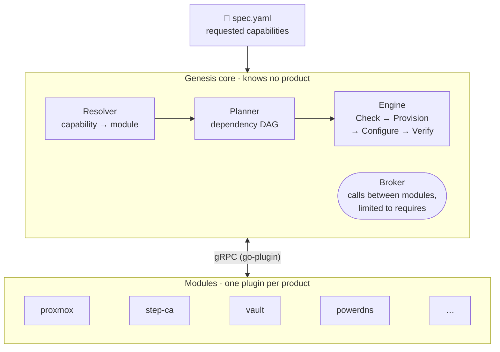
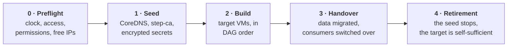

<p align="center">
  
</p>

<p align="center">
  <a href="https://github.com/WhiteRoseLK/genesis/actions/workflows/ci.yml"></a>
  <a href="https://github.com/WhiteRoseLK/genesis/releases"></a>
  <a href="go.mod"></a>
  <a href="LICENSE"></a>
</p>

<p align="center">
  <a href="#-why-genesis">Why</a> ·
  <a href="#-how-it-works">How it works</a> ·
  <a href="#-what-a-spec-looks-like">Example</a> ·
  <a href="#-getting-started">Getting started</a> ·
  <a href="#%EF%B8%8F-roadmap">Roadmap</a> ·
  <a href="#-documentation">Documentation</a>
</p>

---

**Genesis** automatically builds a **self-sufficient infrastructure foundation** (time, DNS, PKI, secrets, bastion) on an existing virtualisation cluster, from a **single YAML file** that describes *capabilities*, not technologies.

You write "I need DNS, a PKI and a bastion"; Genesis picks the modules, works out the order, creates the VMs, installs and verifies each service, then **hands over** to the environment it has just built.

> [!WARNING]
> **Under development (iteration 1, v0.x).** The API, the spec format and the module contract may still change. The modules have not yet run against a real Proxmox cluster: they are tested against fixtures and disposable containers ([#30](https://github.com/WhiteRoseLK/genesis/issues/30)). Do not use in production.

## ✨ Why Genesis

- **You describe the need, not the recipe.** The spec lists capabilities (`dns`, `pki`, `bastion`…); the module that provides them is a detail, and replaceable.
- **A core that knows no product.** Each product (PowerDNS, Vault, Teleport…) is a separate module, as a gRPC plugin. Adding a product, or a whole layer such as building the hypervisor, means adding a module, without touching the core.
- **Chicken and egg, solved.** To build a DNS server, you need… a DNS server. Genesis starts from a **seed** (VM, server, Raspberry Pi) that provides temporary services, builds the target, hands over to it, then **steps aside**.
- **Safe to re-run.** Each step checks before acting: re-running `apply` changes nothing if everything already complies, and resumes where an interrupted run stopped.
- **No plaintext secret.** Secrets are generated, encrypted (age), then migrated to Vault; masked in logs, state and errors.

## 🌱 How it works



The build order is written nowhere: it follows from the functions each module declares it provides (`provides`) and requires (`requires`). A module talks to another only through the **broker**, and only for the functions it has declared: vault, for example, gets its certificate from step-ca by calling `pki.issuer/v1` through the broker, without knowing about step-ca.

### The lifecycle of an `apply`



### Iteration 1 capabilities and modules

| Capability | During the seed phase | Target service | Function |
|---|---|---|---|
| `compute` | — | **proxmox** | `compute.vm/v1` (Proxmox VE VMs) |
| `time` | upstream NTP | **chrony** | `time.ntp/v1` |
| `dns` | **coredns** | **powerdns** | `dns.zone/v1`, `dns.resolver/v1` |
| `pki` | **step-ca** | **vault** | `pki.issuer/v1` |
| `secrets` | encrypted files (age) | **vault** | `secrets.kv/v1` |
| `bastion` | — | **teleport** | `access.ssh/v1`, agent on every VM |

On top of these come `base-os` (common configuration of every VM: CA, resolver, NTP) and `fake-compute` (VMs simulated as containers, for end-to-end tests).

## 📄 What a spec looks like

```yaml
apiVersion: genesis/v1alpha1
kind: Environment
metadata:
  name: lab

network:
  cidr: 10.10.0.0/24
  gateway: 10.10.0.1
  pool: 10.10.0.50-10.10.0.99
  domain: lab.internal

seed:
  address: 10.10.0.10

capabilities:
  compute:
    module: proxmox
    config:
      endpoint: https://pve01.home.arpa:8006
      node: pve01
      image: debian-13
      credentials:
        token_id_ref: env://PVE_TOKEN_ID          # never a plaintext secret:
        token_secret_ref: env://PVE_TOKEN_SECRET  # env://, file:// or vault://
  time:    {}                  # default module
  dns:     { module: powerdns }
  pki:     { module: vault }
  secrets: { module: vault }   # same module as pki → same instance
  bastion: { module: teleport }
```

Full example and validation rules: [docs/04-spec.md](docs/04-spec.md).

## 🚀 Getting started

Prerequisites: Go (the version in [`go.mod`](go.mod)), `make`, and Docker or Podman for the integration tests.

```sh
git clone https://github.com/WhiteRoseLK/genesis.git && cd genesis
make tools build test          # pinned tools, build, unit tests

go run ./cmd/genesis --version
go run ./cmd/genesis validate -f spec.yaml   # validates the spec's structure
go run ./cmd/genesis plan -f spec.yaml       # selected modules and build order
```

| Command | Role | Status |
|---|---|---|
| `genesis init` | Seed prerequisites, local state, master key | ✅ |
| `genesis validate` | Spec structure (module resolution still to be wired in) | ✅ |
| `genesis plan` | Build order, automatically added modules | ✅ |
| `genesis apply` | Seed → build → handover → retirement | ✅ |
| `genesis modules list · install · verify · scaffold` | Management of installed modules | ✅ |
| `genesis secrets list · get` | Generated secrets (metadata, then the value on request) | ✅ |
| `genesis status`, `genesis destroy` | State per module; deletion of the environment | 🚧 |

### Writing a module

```sh
go run ./cmd/genesis modules scaffold my-module --provides dns.zone/v1
```

Generates `modules/my-module/`: manifest, `main.go` with each step as a stub, configuration schema and conformance test. Nothing to change anywhere else in the repository. Step-by-step guide: [docs/10-adding-a-module.md](docs/10-adding-a-module.md).

## 🗺️ Roadmap

- [x] **M0–M2** · Skeleton, spec and validation, encrypted secrets and state
- [x] **M3** · Module SDK, plugin host, `scaffold`
- [x] **M4** · Resolver, broker, planner, engine
- [x] **M5** · `proxmox`, `base-os`
- [x] **M6** · `chrony`, `coredns`, `powerdns`, first seed → target handover
- [x] **M7** · `step-ca`, `vault`, migration of secrets to Vault
- [x] **M8** · `teleport`, automatic seed retirement
- [ ] **M9** · Hardening and end-to-end proof of extensibility ([milestone](https://github.com/WhiteRoseLK/genesis/milestone/1), [#2](https://github.com/WhiteRoseLK/genesis/issues/2))

Beyond iteration 1: air-gapped mode, monitoring, software forge, building the hypervisor on bare metal. Details: [docs/PROGRESS.md](docs/PROGRESS.md) and [docs/08-milestones.md](docs/08-milestones.md).

## 📚 Documentation

<details>
<summary><b>Design documents</b> (10 documents)</summary>

| # | Document | Contents |
|---|----------|---------|
| 01 | [Vision and scope](docs/01-vision-scope.md) | Problem, goals, non-goals of iteration 1 |
| 02 | [Modular architecture](docs/02-architecture.md) | Core, modules, functions, broker, repository layout |
| 03 | [Module contract](docs/03-module-contract.md) | Manifest, gRPC protocol, functions, rules |
| 04 | [Spec format](docs/04-spec.md) | YAML schema, validation rules, full example |
| 05 | [Bootstrap lifecycle](docs/05-bootstrap-lifecycle.md) | Seed → target → handover → retirement |
| 06 | [Secrets and state](docs/06-secrets-state.md) | Generation, storage, migration to Vault, state file |
| 07 | [Iteration 1 modules](docs/07-mvp-modules.md) | proxmox, base-os, chrony, coredns, powerdns, step-ca, vault, teleport |
| 08 | [Milestones](docs/08-milestones.md) | Development plan and acceptance criteria |
| 09 | [Decisions (ADRs)](docs/09-decisions.md) | Structural choices and accepted debt |
| 10 | [Adding a module](docs/10-adding-a-module.md) | Procedure, examples |

</details>

- **Progress**: [docs/PROGRESS.md](docs/PROGRESS.md) · detailed history: [docs/journal.md](docs/journal.md)
- **Technical debt**: [`tech-debt` issues](https://github.com/WhiteRoseLK/genesis/issues?q=is%3Aissue+is%3Aopen+label%3Atech-debt)
- **Release notes**: [CHANGELOG.md](CHANGELOG.md)

## 🤝 Contributing

Contributions go through atomic PRs, squash-merged, with a Conventional Commits title: see [CONTRIBUTING.md](CONTRIBUTING.md). All participation is subject to the [code of conduct](CODE_OF_CONDUCT.md). Report vulnerabilities privately, never in a public issue: see [SECURITY.md](SECURITY.md).

Instructions for AI coding assistants are in [AGENTS.md](AGENTS.md).

## 📜 License

[Apache 2.0](LICENSE).
