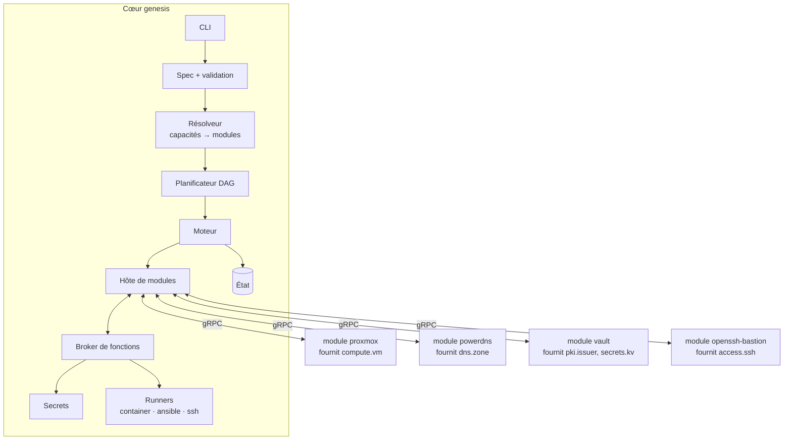

# 02 — Architecture modulaire

## Principe directeur
Genesis n'est **pas un monolithe**. Il se compose :
- d'un **cœur** minimal et stable, qui ne connaît aucun produit (ni Proxmox, ni PowerDNS, ni Vault) ;
- de **modules** indépendants, un par produit, qui implémentent des **fonctions** normalisées.

Ajouter un produit (Bind au lieu de PowerDNS, Nutanix au lieu de Proxmox, GitLab, la construction d'un hyperviseur…) = **écrire un module**, sans modifier le cœur ni les autres modules.

## Vocabulaire
| Terme | Définition | Exemple |
|---|---|---|
| **Fonction** | Service abstrait, défini par une **API versionnée** dans le SDK | `dns.zone/v1`, `compute.vm/v1`, `pki.issuer/v1` |
| **Capacité** | Ce que l'utilisateur demande dans la spec ; se résout en une ou plusieurs fonctions | `dns` → `dns.zone` + `dns.resolver` |
| **Module** | Implémentation packagée d'un produit : manifest + binaire plugin + assets | `powerdns`, `proxmox`, `vault` |
| **Couche** | Étiquette d'affichage et de tri, **jamais une contrainte codée en dur** | `physical`, `platform`, `foundation`, `services` |

L'ordre de construction découle **uniquement** des dépendances entre fonctions. C'est ce qui permet d'insérer plus tard la construction de l'hyperviseur « avant le reste » sans rien réécrire : un module qui fournit la plateforme devient simplement un prédécesseur dans le graphe.

## Vue d'ensemble



## Comment les modules interagissent
**Jamais directement.** Un module appelle une *fonction*, pas un autre module :

```
module vault  --appelle-->  compute.vm/v1.EnsureVM   --broker-->  module proxmox
module vault  --appelle-->  dns.zone/v1.UpsertRecord --broker-->  module powerdns (ou coredns en phase graine)
module bastion--appelle-->  pki.issuer/v1.SignSSH    --broker-->  module vault
```

Le broker route l'appel vers le module qui fournit la fonction **à cet instant** (graine ou cible, doc 05). Conséquences :
- remplacer PowerDNS par Bind ne touche pas le module Vault ;
- un module peut être testé seul avec des fonctions simulées ;
- la passation graine → cible est transparente pour les consommateurs.

Les secrets passent par le broker via la fonction intégrée `core.secrets/v1` (le cœur décide du backend : fichiers ou Vault).

## Composants du cœur

### Spec (`internal/spec`)
Charge, applique les défauts, valide la structure. La validation propre à chaque module est **déléguée au module** (`Validate`) à partir du schéma JSON qu'il publie.

### Résolveur (`internal/resolver`)
- Associe chaque capacité demandée à un module (choix explicite dans la spec, sinon module par défaut de la capacité).
- Ajoute automatiquement les modules requis manquants (fonction requise non fournie) et les signale.
- Vérifie la compatibilité des versions d'API de fonctions et du cœur.
- Échoue si une fonction requise n'a aucun fournisseur, ou en a plusieurs sans choix explicite.

### Planificateur (`internal/planner`)
DAG sur les **fonctions**, étapes par module (`seed.up`, `provision`, `configure`, `verify`, `handover`, `repoint`, `seed.retire`), diff état désiré / état courant, détection de cycles.

### Moteur (`internal/engine`)
Exécution, reprise, audit. Parallélisme autorisé plus tard entre branches indépendantes du DAG (le design doit le permettre : aucune variable globale mutable).

### Hôte de modules (`internal/modulehost`)
- Découverte des modules installés, lecture des manifests, lancement des binaires plugins (HashiCorp `go-plugin`, gRPC sur socket locale, handshake avec version de protocole).
- Surveillance : un module qui plante n'entraîne pas le cœur ; l'étape échoue proprement.
- Vérification de l'empreinte SHA-256 de chaque module contre `genesis.lock`.

### Broker de fonctions (`internal/broker`)
Registre `fonction → fournisseur actif`, routage des appels entre modules, contrôle d'accès : un module ne peut appeler **que les fonctions déclarées dans ses `requires`**, et ne peut lire **que ses propres secrets** et ceux explicitement partagés.

### État, secrets, runners
Inchangés (doc 06). Les runners sont exposés aux modules comme fonctions intégrées : `core.ansible/v1`, `core.container/v1`, `core.ssh/v1`. Un module n'a donc pas besoin d'embarquer Ansible ou un client SSH.

## SDK (`sdk/`)
Module Go publié séparément, **seule dépendance autorisée pour un module** :
- `sdk/proto/` : définitions protobuf du protocole module et de chaque fonction (`sdk/proto/functions/dns/zone/v1/zone.proto`…).
- `sdk/go/` : code généré + helpers (`module.Serve(impl)`, client broker typé, types `Secret` avec redaction, harnais de test avec fonctions simulées).
- Les API de fonctions suivent le versionnement sémantique ; une rupture = nouvelle version (`v2`) servie en parallèle de `v1` pendant la transition.

## Organisation du dépôt (monorepo, artefacts séparés)

```
cmd/genesis/                  binaire du cœur
internal/                     cœur (aucun import de modules/)
  spec/ resolver/ planner/ engine/ modulehost/ broker/ state/ secrets/ runner/
sdk/                          module Go séparé (go.mod propre)
  proto/  go/
modules/                      chaque module = go.mod propre + binaire propre
  proxmox/
    module.yaml
    main.go
    assets/
  powerdns/  coredns/  chrony/  vault/  step-ca/  openssh-bastion/  base-os/
  fake-compute/               module de test
docs/
test/e2e/
```

Règle vérifiée en CI : `internal/` n'importe jamais `modules/`, et `modules/*` n'importe que `sdk/` (plus ses dépendances tierces).

## Installation et distribution des modules
- Répertoires de recherche : `$GENESIS_MODULE_PATH`, `~/.local/share/genesis/modules`, `/usr/lib/genesis/modules`.
- Arborescence : `<nom>/<version>/{module.yaml, module-<os>-<arch>, assets/}`.
- `genesis modules list | install <nom>@<version> | verify`.
- `genesis.lock` (à côté de la spec) fige nom, version et empreinte de chaque module utilisé → reproductibilité et compatibilité air-gap future.
- Les modules officiels sont livrés avec le cœur dans l'itération 1 ; un registre distant et la signature des modules viendront plus tard.

## CLI
| Commande | Rôle |
|---|---|
| `genesis init` | Prérequis graine, `state_dir`, clé maîtresse |
| `genesis modules list/install/verify` | Gestion des modules |
| `genesis validate -f env.yaml` | Spec + résolution des modules + `Validate` de chaque module |
| `genesis plan -f env.yaml` | Plan, avec couches et modules ajoutés automatiquement |
| `genesis apply -f env.yaml [--auto-approve]` | Exécution jusqu'à la passation |
| `genesis status` | État par module et par fonction (fournisseur actif) |
| `genesis secrets list/get` | Secrets générés |
| `genesis seed retire` | Arrêt des services graine |
| `genesis destroy -f env.yaml` | Suppression des ressources cibles |
