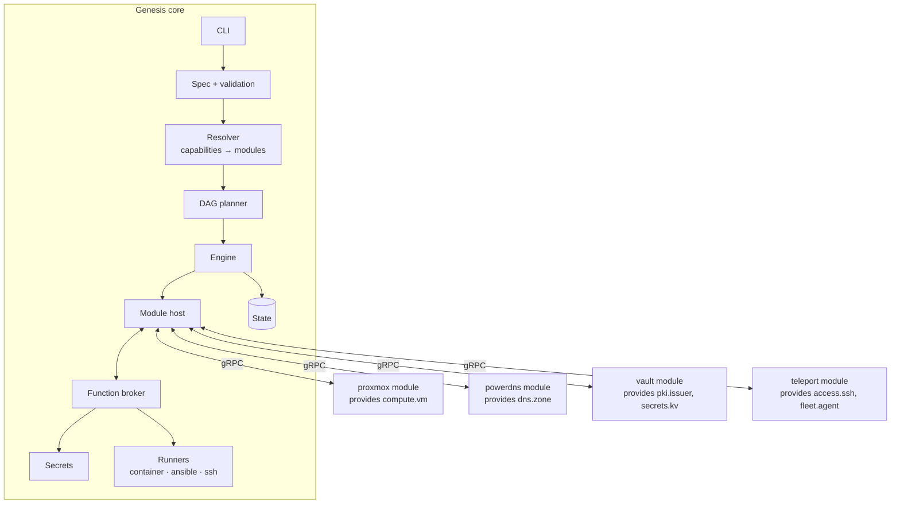

# 02 — Modular architecture

## Guiding principle
Genesis is **not a monolith**. It is made of:
- a minimal, stable **core** that knows no product (neither Proxmox, nor PowerDNS, nor Vault);
- independent **modules**, one per product, that implement standardised **functions**.

Adding a product (Bind instead of PowerDNS, Nutanix instead of Proxmox, GitLab, building a hypervisor…) = **writing a module**, without changing the core or the other modules.

## Vocabulary
| Term | Definition | Example |
|---|---|---|
| **Function** | Abstract service, defined by a **versioned API** in the SDK | `dns.zone/v1`, `compute.vm/v1`, `pki.issuer/v1` |
| **Capability** | What the user asks for in the spec; resolves to one or more functions | `dns` → `dns.zone` + `dns.resolver` |
| **Module** | Packaged implementation of a product: manifest + plugin binary + assets | `powerdns`, `proxmox`, `vault` |
| **Layer** | A label for display and sorting, **never a hard-coded constraint** | `physical`, `platform`, `foundation`, `services` |
| **Fleet module** | A module whose provided function has **several providers active at the same time**, all of them called (as opposed to the default mode, a single active provider) — its presence in the spec then affects every VM in the fleet, rather than being one capability chosen among several (ADR-017) | `teleport` (`fleet.agent/v1`) |

The build order follows **only** from the dependencies between functions. This is what allows building the hypervisor to be inserted "before everything else" later without rewriting anything: a module that provides the platform simply becomes a predecessor in the graph.

## Overview



## How modules interact
**Never directly.** A module calls a *function*, not another module:

```
vault module   --calls-->  compute.vm/v1.EnsureVM   --broker-->  proxmox module
vault module   --calls-->  dns.zone/v1.UpsertRecord --broker-->  powerdns module (or coredns during the seed phase)
bastion module --calls-->  pki.issuer/v1.SignSSH    --broker-->  vault module
```

The broker routes the call to the module that provides the function **at that moment** (seed or target, doc 05). Consequences:
- replacing PowerDNS with Bind does not touch the Vault module;
- a module can be tested on its own against simulated functions;
- the seed → target handover is transparent to consumers.

Secrets go through the broker via the built-in `core.secrets/v1` function (the core decides the backend: files or Vault).

### "Fleet" functions (several simultaneous providers)
The default mode (`dns.zone`, `time.ntp`, `pki.issuer`…) routes a function to **one** active provider at a time — an exclusive choice between competing products, which can be repointed during a handover (doc 05). Some functions do not have these semantics: their role is to be applied to *every* VM in the fleet, and several can be active at once (e.g. `fleet.agent/v1`, provided by `teleport` and, later, a future monitoring/logging module — ADR-017). For these functions, declared as "multi-provider", the broker calls **every** installed module that provides them, with the `target` (VM, service SSH key) the caller already knows — never a key shared between modules. Every module that provisions a VM (`chrony`, `powerdns`, `vault`…) calls these functions from `Configure`, just as it calls `os.base/v1`. Since the project always builds an entire infrastructure from scratch (never an addition to a fleet already in production), the classic DAG planner is enough to guarantee the order: a "fleet" module is built before any module that depends on it, with no reactive mechanism.

## Core components

### Spec (`internal/spec`)
Loads, applies defaults, validates the structure. Module-specific validation is **delegated to the module** (`Validate`) using the JSON schema it publishes.

### Resolver (`internal/resolver`)
- Maps each requested capability to a module (explicit choice in the spec, otherwise the capability's default module).
- Automatically adds missing required modules (a required function that nothing provides) and reports them.
- Checks the compatibility of function API versions and of the core.
- Fails if a required function has no provider, or several without an explicit choice.

### Planner (`internal/planner`)
A DAG over **functions**, steps per module (`seed.up`, `provision`, `configure`, `verify`, `handover`, `repoint`, `seed.retire`), desired state / current state diff, cycle detection.

### Engine (`internal/engine`)
Execution, resumption, audit. Parallelism between independent branches of the DAG may be allowed later (the design must permit it: no mutable global variable).

### Module host (`internal/modulehost`)
- Discovers installed modules, reads manifests, launches plugin binaries (HashiCorp `go-plugin`, gRPC over a local socket, handshake with a protocol version).
- Supervision: a crashing module does not take the core down; the step fails cleanly.
- Verifies each module's SHA-256 digest against `genesis.lock`.

### Function broker (`internal/broker`)
A `function → active provider` registry, routing of calls between modules, access control: a module can call **only the functions declared in its `requires`**, and can read **only its own secrets** and those explicitly shared. Two resolution modes: a single active provider (default, repointable) and fan-out to several simultaneous providers ("fleet" functions, see above, ADR-017).

### State, secrets, runners
See doc 06. Runners are exposed to modules as built-in functions: `core.ansible/v1`, `core.container/v1`, `core.ssh/v1`. A module therefore does not need to embed Ansible or an SSH client.

## SDK (`sdk/`)
A separately published Go module, **the only dependency allowed for a module**:
- `sdk/proto/`: protobuf definitions of the module protocol and of each function (`sdk/proto/functions/dns/zone/v1/zone.proto`…).
- `sdk/go/`: generated code + helpers (`module.Serve(impl)`, typed broker client, `Secret` types with redaction, test harness with simulated functions).
- Function APIs follow semantic versioning; a breaking change = a new version (`v2`) served alongside `v1` during the transition.

## Repository layout (monorepo, separate artefacts)

```
cmd/genesis/                  core binary
internal/                     core (no import of modules/)
  spec/ resolver/ planner/ engine/ modulehost/ broker/ state/ secrets/ runner/
sdk/                          separate Go module (its own go.mod)
  proto/  go/
modules/                      each module = its own go.mod + its own binary
  proxmox/
    module.yaml
    main.go
    assets/
  powerdns/  coredns/  chrony/  vault/  step-ca/  teleport/  base-os/
  fake-compute/               test module
docs/
test/
  modules/                    test modules (panicking, test-a…test-kv)
  integration/                each module through the real module host,
                              required functions simulated (`docker` tag when
                              real containers are driven)
  e2e/                        end to end on Proxmox (`integration` tag)
```

Rule enforced in CI: `internal/` never imports `modules/`, and `modules/*` imports only `sdk/` (plus its third-party dependencies).

## Installing and distributing modules
- Search directories: `$GENESIS_MODULE_PATH`, `~/.local/share/genesis/modules`, `/usr/lib/genesis/modules`.
- Layout: `<name>/<version>/{module.yaml, module-<os>-<arch>, assets/}`.
- `genesis modules list | install <name>@<version> | verify`.
- `genesis.lock` (next to the spec) pins the name, version and digest of each module used → reproducibility and future air-gap compatibility.
- Official modules ship with the core in iteration 1; a remote registry and module signing will come later.

## CLI
| Command | Role |
|---|---|
| `genesis init` | Seed prerequisites, `state_dir`, master key |
| `genesis modules list/install/verify` | Module management |
| `genesis validate -f env.yaml` | Spec + module resolution + each module's `Validate` |
| `genesis plan -f env.yaml` | Plan, with layers and automatically added modules |
| `genesis apply -f env.yaml [--auto-approve]` | Full run: seed, target, handovers, then automatic seed retirement if everything is green (ADR-020) |
| `genesis status` | State per module and per function (active provider) |
| `genesis secrets list/get` | Generated secrets |
| `genesis destroy -f env.yaml` | Deletion of target resources |
