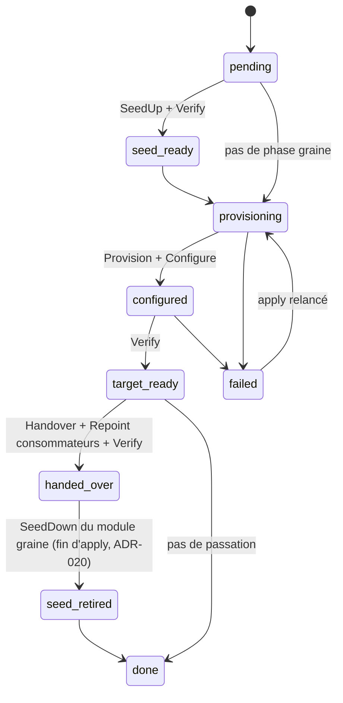

# 03 — Contrat de module

Le contrat est **le point le plus important du design**. Tout produit, logiciel ou physique, entre dans Genesis en le respectant.

## 1. Manifest `module.yaml`

```yaml
apiVersion: genesis/module/v1
name: vault
version: 0.1.0
description: HashiCorp Vault — PKI et stockage de secrets
layer: foundation
core: ">=0.1.0 <0.2.0"
protocol: 1                       # version du protocole gRPC module ↔ cœur

capabilities:                     # capacités utilisateur que ce module peut satisfaire
  - pki
  - secrets

provides:
  - function: pki.issuer/v1
    phases: [target]
  - function: secrets.kv/v1
    phases: [target]

requires:
  seed:
    - core.secrets/v1
  target:
    - compute.vm/v1
    - time.ntp/v1
    - dns.zone/v1
    - pki.issuer/v1@seed          # cert TLS initial de Vault
    - core.ansible/v1

config_schema: schema.json        # JSON Schema de la section de spec du module

secrets:
  - { name: root-token, kind: token, rotation: on-handover, recovery: true }
  - { name: unseal-keys, kind: shamir-shares, recovery: true }

resources:
  - { role: vault, count: 1, size: medium }

defaults:                         # ce module est-il l'implémentation par défaut ?
  pki: true
  secrets: true
```

Suffixe `@seed` / `@target` : force le fournisseur. Sans suffixe : le fournisseur actif au moment de l'appel.

Un module qui ne fournit **que** des fonctions de phase graine (ex. `coredns`, `step-ca`) déclare `phases: [seed]`. Un module peut fournir la même fonction dans les deux phases.

## 2. Protocole de cycle de vie (gRPC, `sdk/proto/module/v1`)

```protobuf
service Module {
  rpc Describe(Empty)              returns (Manifest);
  rpc Validate(ValidateRequest)    returns (Diagnostics);   // config utilisateur
  rpc Check(StepRequest)           returns (CheckResult);   // Conforme | ÀFaire | Dérive + détail
  rpc SeedUp(StepRequest)          returns (StepResult);
  rpc SeedDown(StepRequest)        returns (StepResult);
  rpc Provision(StepRequest)       returns (StepResult);
  rpc Configure(StepRequest)       returns (StepResult);
  rpc Verify(StepRequest)          returns (StepResult);
  rpc Handover(StepRequest)        returns (StepResult);
  rpc Repoint(RepointRequest)      returns (StepResult);    // un fournisseur a changé
  rpc Destroy(StepRequest)         returns (StepResult);
}
```

`StepRequest` contient : identifiant d'exécution, configuration résolue du module, extrait d'état propre au module, **jeton d'accès broker** limité aux fonctions déclarées.
`StepResult` contient : statut, données d'état à persister (opaque pour le cœur, JSON), endpoints publiés, diagnostics.

Le module ne persiste rien lui-même : **le cœur est seul propriétaire de l'état**.

## 3. Fonctions (`sdk/proto/functions/...`)
Un module qui fournit une fonction implémente son service gRPC ; un module qui la requiert l'appelle via le client broker du SDK.

Fonctions de l'itération 1 :

| Fonction | Opérations principales | Fournisseurs MVP |
|---|---|---|
| `core.secrets/v1` | Ensure, Get, Put, List | cœur |
| `core.ansible/v1` | RunPlaybook(assets, inventaire, vars) | cœur |
| `core.container/v1` | Run, Stop, Status (sur la graine) | cœur |
| `core.ssh/v1` | Exec, Copy | cœur |
| `compute.vm/v1` | EnsureImage, EnsureVM, GetVM, DeleteVM, Now | `proxmox`, `fake-compute` |
| `os.base/v1` | Harden(vm), TrustCA, SetResolver, SetNTP | `base-os` |
| `time.ntp/v1` | Endpoint | `chrony` |
| `dns.zone/v1` | UpsertRecord, DeleteRecord, ListRecords, Endpoint | `coredns` (seed), `powerdns` |
| `dns.resolver/v1` | Endpoint | `coredns` (seed), `powerdns` |
| `pki.issuer/v1` | IssueCert, SignCSR, SignSSH, CAChain | `step-ca` (seed), `vault` |
| `secrets.kv/v1` | Read, Write, List | `vault` |
| `access.ssh/v1` | JumpHost, SignUserKey | `teleport` |
| `fleet.agent/v1` | Install(target) — fonction « de parc », tous les fournisseurs installés sont appelés (ADR-017), pas un seul fournisseur actif | `teleport` |

Exemple de définition :

```protobuf
// sdk/proto/functions/dns/zone/v1/zone.proto
service DnsZone {
  rpc UpsertRecord(Record) returns (Empty);
  rpc DeleteRecord(RecordKey) returns (Empty);
  rpc ListRecords(Zone) returns (Records);
  rpc Endpoint(Empty) returns (Endpoint);
}
message Record { string zone = 1; string name = 2; string type = 3; repeated string values = 4; uint32 ttl = 5; }
```

## 4. Règles
1. **Aucun appel direct entre modules**, uniquement via le broker et des fonctions déclarées dans `requires`.
2. **`Verify` teste la fonction réellement** depuis un point de vue consommateur (autre VM), pas l'état d'un processus.
3. **Toutes les opérations sont idempotentes** ; `Check` précède toujours l'action.
4. **`Handover` et `Repoint` sont rejouables.**
5. **Les secrets** sont obtenus via `core.secrets/v1` par nom logique ; un module ne génère ni ne stocke de secret en dehors.
6. **Pas d'état local dans le module** ; tout ce qui doit survivre passe par `StepResult.state`.
7. **Un module doit être testable seul** avec le harnais du SDK (fonctions requises simulées).
8. **Porte de sortie** : chaque fonction accepte un champ `extra` (map) pour les paramètres propres à un produit, sans casser l'API commune.

## 5. Machine à états d'un module


