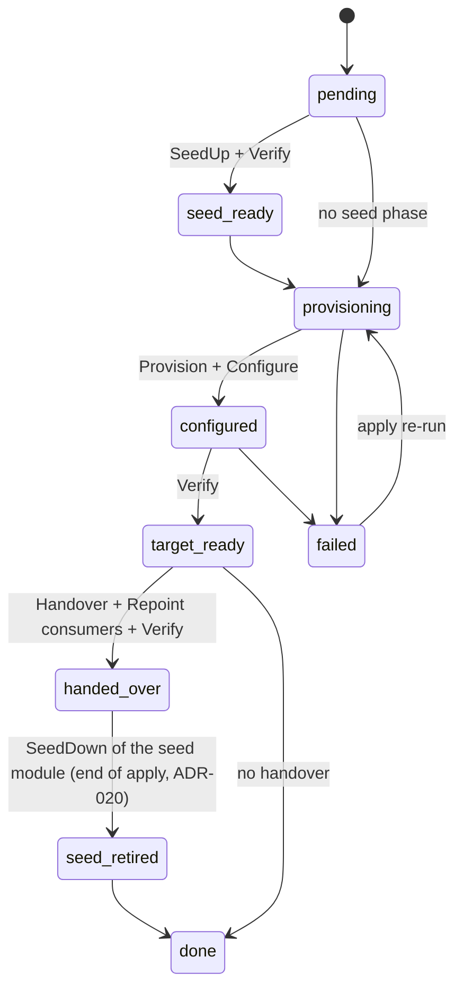

# 03 — Module contract

The contract is **the most important part of the design**. Every product, software or physical, enters Genesis by honouring it.

## 1. `module.yaml` manifest

```yaml
apiVersion: genesis/module/v1
name: vault
version: 0.1.0
description: HashiCorp Vault — PKI and secret storage
layer: foundation
core: ">=0.1.0 <0.2.0"
protocol: 1                       # version of the module ↔ core gRPC protocol

capabilities:                     # user capabilities this module can satisfy
  - pki
  - secrets

provides:
  - function: pki.issuer/v1
    phases: [target]
  - function: secrets.kv/v1
    phases: [target]

requires:
  seed:
    - core.secrets/v1
  target:
    - compute.vm/v1
    - time.ntp/v1
    - dns.zone/v1
    - pki.issuer/v1@seed          # Vault's initial TLS certificate
    - core.ansible/v1

config_schema: schema.json        # JSON Schema of the module's spec section

secrets:
  - { name: root-token, kind: token, rotation: on-handover, recovery: true }
  - { name: unseal-keys, kind: shamir-shares, recovery: true }

resources:
  - { role: vault, count: 1, size: medium }

defaults:                         # is this module the default implementation?
  pki: true
  secrets: true
```

`@seed` / `@target` suffix: forces the provider. Without a suffix: the provider active at the time of the call.

A module that provides **only** seed-phase functions (e.g. `coredns`, `step-ca`) declares `phases: [seed]`. A module may provide the same function in both phases.

## 2. Lifecycle protocol (gRPC, `sdk/proto/module/v1`)

```protobuf
service Module {
  rpc Describe(Empty)              returns (Manifest);
  rpc Validate(ValidateRequest)    returns (Diagnostics);   // user config
  rpc Check(StepRequest)           returns (CheckResult);   // Compliant | ToDo | Drift + detail
  rpc SeedUp(StepRequest)          returns (StepResult);
  rpc SeedDown(StepRequest)        returns (StepResult);
  rpc Provision(StepRequest)       returns (StepResult);
  rpc Configure(StepRequest)       returns (StepResult);
  rpc Verify(StepRequest)          returns (StepResult);
  rpc Handover(StepRequest)        returns (StepResult);
  rpc Repoint(RepointRequest)      returns (StepResult);    // a provider has changed
  rpc Destroy(StepRequest)         returns (StepResult);
}
```

`StepRequest` contains: the run ID, the module's resolved configuration, the module's own slice of the state, and a **broker access token** limited to the declared functions.
`StepResult` contains: status, state data to persist (opaque to the core, JSON), published endpoints, diagnostics.

The module persists nothing itself: **the core alone owns the state**.

## 3. Functions (`sdk/proto/functions/...`)
A module that provides a function implements its gRPC service; a module that requires it calls it through the SDK's broker client.

Iteration 1 functions:

| Function | Main operations | MVP providers |
|---|---|---|
| `core.secrets/v1` | Ensure, Get, Put, List | core |
| `core.ansible/v1` | RunPlaybook(assets, inventory, vars) | core |
| `core.container/v1` | Run, Stop, Status (on the seed) | core |
| `core.ssh/v1` | Exec, Copy | core |
| `compute.vm/v1` | EnsureImage, EnsureVM, GetVM, DeleteVM, Now | `proxmox`, `fake-compute` |
| `os.base/v1` | Harden(vm), TrustCA, SetResolver, SetNTP | `base-os` |
| `time.ntp/v1` | Endpoint | `chrony` |
| `dns.zone/v1` | UpsertRecord, DeleteRecord, ListRecords, Endpoint | `coredns` (seed), `powerdns` |
| `dns.resolver/v1` | Endpoint | `coredns` (seed), `powerdns` |
| `pki.issuer/v1` | IssueCert, SignCSR, SignSSH, CAChain | `step-ca` (seed), `vault` |
| `secrets.kv/v1` | Read, Write, List | `vault` |
| `access.ssh/v1` | JumpHost, SignUserKey | `teleport` |
| `fleet.agent/v1` | Install(target) — a "fleet" function: every installed provider is called (ADR-017), not a single active provider | `teleport` |

Example definition:

```protobuf
// sdk/proto/functions/dns/zone/v1/zone.proto
service DnsZone {
  rpc UpsertRecord(Record) returns (Empty);
  rpc DeleteRecord(RecordKey) returns (Empty);
  rpc ListRecords(Zone) returns (Records);
  rpc Endpoint(Empty) returns (Endpoint);
}
message Record { string zone = 1; string name = 2; string type = 3; repeated string values = 4; uint32 ttl = 5; }
```

## 4. Rules
1. **No direct calls between modules**, only through the broker and functions declared in `requires`.
2. **`Verify` really tests the function** from a consumer's point of view (another VM), not the state of a process.
3. **Every operation is idempotent**; `Check` always comes before the action.
4. **`Handover` and `Repoint` can be replayed.**
5. **Secrets** are obtained through `core.secrets/v1` by logical name; a module neither generates nor stores a secret anywhere else.
6. **No local state in the module**; anything that must survive goes through `StepResult.state`.
7. **A module must be testable on its own** with the SDK harness (required functions simulated).
8. **Escape hatch**: every function accepts an `extra` field (map) for product-specific parameters, without breaking the common API.

## 5. Module state machine


