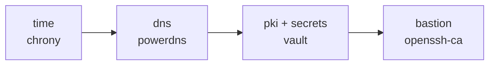
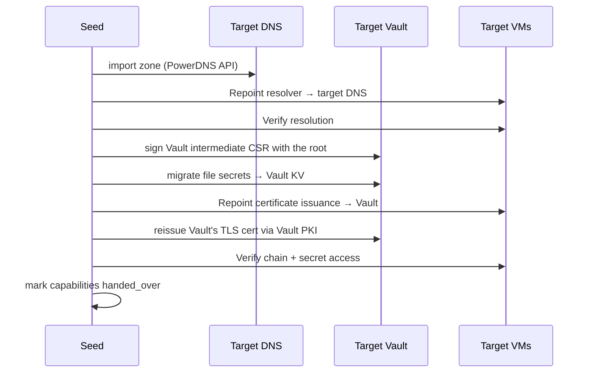

# 05 — Bootstrap lifecycle

## Phases

| Phase | Description |
|---|---|
| 0. Preflight | Seed prerequisites, clock, access to the compute module, spec validation |
| 1. Seed | Start the temporary services that are needed |
| 2. Build | Provision + configure the target capabilities in DAG order |
| 3. Handover | Migrate data and switch consumers over; the seed stays active |
| 4. Retirement | Automatic at the end of `apply` if everything is green: the seed services stop |

## Phase 0 — Preflight (blocking)
1. A working container runtime is present.
2. **Clock**: drift between the seed's clock and `compute.vm/v1.Now` < 5 s, and NTP synchronisation active (Internet available in iteration 1). Otherwise stop with an explicit message. This is the first dependency of the whole chain.
3. Each module's `Validate`: compute API access, sufficient permissions (VM creation, storage, network), available resources.
4. Pool IPs unused (ping + ARP).
5. Master key present (`init` has run).

## Phase 1 — Seed services (iteration 1)

| Function | Seed implementation | Rationale |
|---|---|---|
| `time.ntp` | none (connected profile) | Targets synchronise with `upstream_ntp` |
| `dns.authoritative` | CoreDNS in a container, zone generated from the state | VMs need names before the target DNS exists |
| `pki.issuer` | step-ca in a container, "seed" intermediate CA signed by the root | Vault's TLS certificate before Vault exists |
| `secrets.kv` | age-encrypted files on the seed (not a service) | Storage before Vault |

The **root CA** is generated by the tool once and stored in the secret store; it never runs as a service.

## Phase 2 — Build order resulting from the DAG (MVP)

This order is written nowhere: it results from the modules' `requires`. For each module: `Provision` → `Configure` → `Verify`. VMs are created with cloud-init: static IP, resolver = seed, service SSH key generated by the tool, `genesis` service user.

## Phase 3 — Handover

Order: `dns` → `pki` → `secrets` → `bastion`. Each handover is followed by a `Verify` from at least one target VM other than the provider.

## Phase 4 — Retirement
As the build progresses, each target service takes over as soon as it is ready and verified: the modules built afterwards use it. The seed, however, stays active until the end, and its own services keep using it. Retirement is automatic at the end of `apply` (ADR-020), under three conditions:
1. every function provided by the seed has been taken over by a target provider (otherwise the seed is kept, `apply` succeeds and the log lists the functions with no successor);
2. if a `secrets` capability is declared, the secrets have migrated to Vault;
3. a final `Verify` of each target module, in the final configuration, is green (otherwise `apply` fails and the seed is kept).

Then:
- `SeedDown` of each seed module, in reverse plan order (CoreDNS, step-ca…); the state records `seed_retired`, and a later `apply` never starts the seed again.
- The local secret store stays **read-only** as an encrypted backup copy of the recovery secrets (root CA, Vault unseal keys).
- The seed can be shut down or deleted. `apply` tells you what to keep offline before deletion (master key, recovery secrets, state).

## Error recovery
- Each successful step is persisted; `apply` resumes at the first non-compliant step.
- An interrupted handover leaves both providers active; the re-run completes the migration. No `SeedDown` until the handover is verified.
- `apply` never deletes a VM implicitly.
