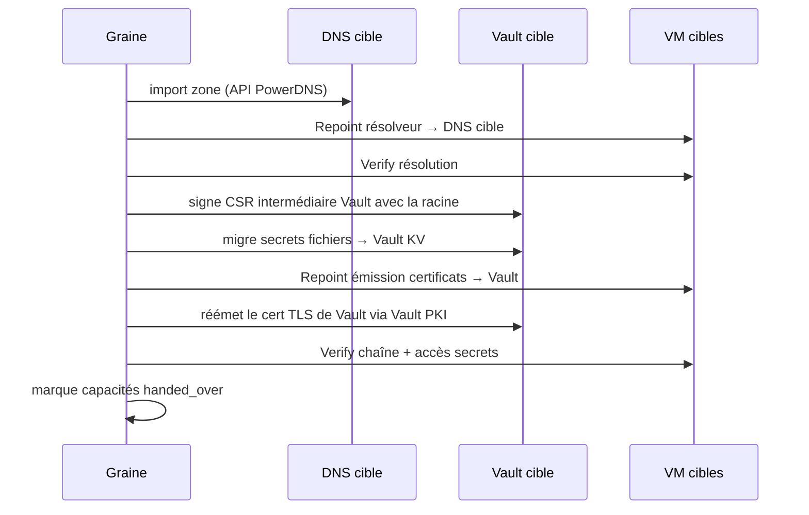

# 05 — Cycle de bootstrap

## Phases

| Phase | Description |
|---|---|
| 0. Pré-vol | Prérequis graine, horloge, accès au module compute, validation spec |
| 1. Graine | Démarrage des services temporaires nécessaires |
| 2. Construction | Provision + configuration des capacités cibles dans l'ordre du DAG |
| 3. Passation | Migration des données et rebascule des consommateurs ; la graine reste active |
| 4. Retrait | Automatique en fin d'`apply` si tout est vert : arrêt des services graine |

## Phase 0 — Pré-vol (bloquante)
1. Runtime conteneur présent et fonctionnel.
2. **Horloge** : écart entre l'heure de la graine et `compute.vm/v1.Now` < 5 s, et synchronisation NTP active (Internet disponible en itération 1). Sinon arrêt avec message explicite. C'est la première dépendance de toute la chaîne.
3. `Validate` de chaque module : accès API compute, droits suffisants (création VM, stockage, réseau), ressources disponibles.
4. IP du pool non utilisées (ping + ARP).
5. Clé maîtresse présente (`init` exécuté).

## Phase 1 — Services graine (itération 1)

| Fonction | Implémentation graine | Justification |
|---|---|---|
| `time.ntp` | aucune (profil connected) | Les cibles se synchronisent sur `upstream_ntp` |
| `dns.authoritative` | CoreDNS en conteneur, zone générée depuis l'état | Les VM ont besoin de noms avant que le DNS cible existe |
| `pki.issuer` | step-ca en conteneur, CA intermédiaire « seed » signée par la racine | Cert TLS de Vault avant Vault |
| `secrets.kv` | fichiers chiffrés age sur la graine (pas un service) | Stockage avant Vault |

La **CA racine** est générée par l'outil une seule fois et stockée dans le secret store ; elle ne tourne jamais comme service.

## Phase 2 — Ordre de construction résultant du DAG (MVP)

Cet ordre n'est écrit nulle part : il résulte des `requires` des modules. Pour chaque module : `Provision` → `Configure` → `Verify`. Les VM sont créées avec cloud-init : IP statique, résolveur = graine, clé SSH de service générée par l'outil, utilisateur de service `genesis`.

## Phase 3 — Passation

Ordre : `dns` → `pki` → `secrets` → `bastion`. Chaque passation est suivie d'un `Verify` depuis au moins une VM cible autre que le fournisseur.

## Phase 4 — Retrait
Au fil de la construction, chaque service cible prend la main dès qu'il est prêt et vérifié : les modules construits ensuite l'utilisent. La graine, elle, reste active jusqu'au bout, et ses propres services continuent de se servir d'elle. Le retrait est automatique en fin d'`apply` (ADR-020), à trois conditions :
1. chaque fonction fournie par la graine a été reprise par un fournisseur cible (sinon la graine est conservée, l'`apply` réussit et le journal indique les fonctions sans relève) ;
2. si une capacité `secrets` est déclarée, les secrets ont migré vers Vault ;
3. un `Verify` final de chaque module cible, dans la configuration définitive, est vert (sinon l'`apply` échoue et la graine est conservée).

Alors :
- `SeedDown` de chaque module graine, dans l'ordre inverse du plan (CoreDNS, step-ca…) ; l'état note `seed_retired`, et un `apply` ultérieur ne relance plus jamais la graine.
- Le secret store local reste en **lecture seule** comme copie de secours chiffrée des secrets de récupération (racine CA, clés de descellement Vault).
- La graine peut être éteinte ou supprimée. `apply` indique ce qu'il faut conserver hors ligne avant suppression (clé maîtresse, secrets de récupération, état).

## Reprise sur erreur
- Chaque étape réussie est persistée ; `apply` reprend à la première étape non conforme.
- Une passation interrompue laisse les deux fournisseurs actifs ; la relance termine la migration. Aucun `SeedDown` tant que la passation n'est pas vérifiée.
- `apply` n'effectue jamais de suppression implicite de VM.
